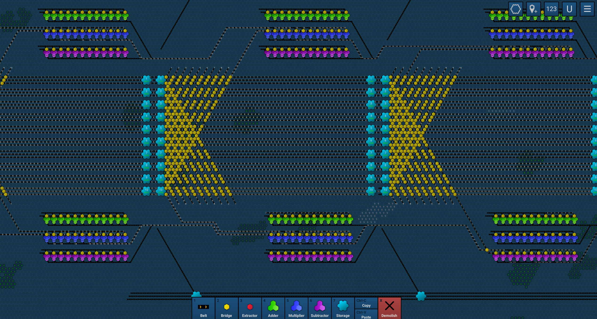

# Beltex minimum arithmetic operations to target number solver

Find the minimum number of sequential arithmetic operations (`+`, `-`, `*`)
to reach a target number using any numbers between `1`–`10`.
Each operation uses the result of the previous step.

e.g:


## Prerequisites

- Python

## Usage

```stdout
$ py ./main.py 844

Minimum steps: 4
Sequence: 2 -> 2+10=12 -> 12*7=84 -> 84*10=840 -> 840+4=844
```
